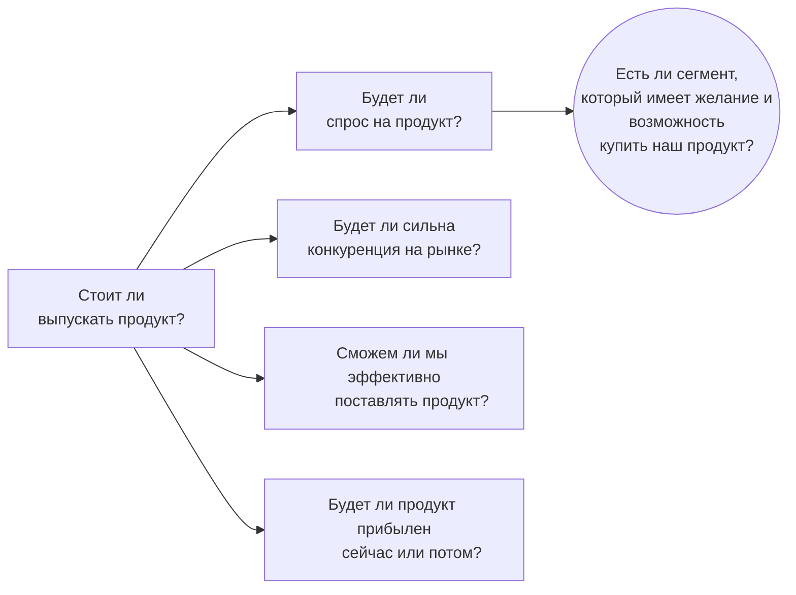

##### Условие кейса

Инженерная компания разработала сенсор, который предсказывает проблемы с механикой с помощью анализа данных о вождении. Стоит ли выпускать этот продукт?

##### Построение фреймворка

